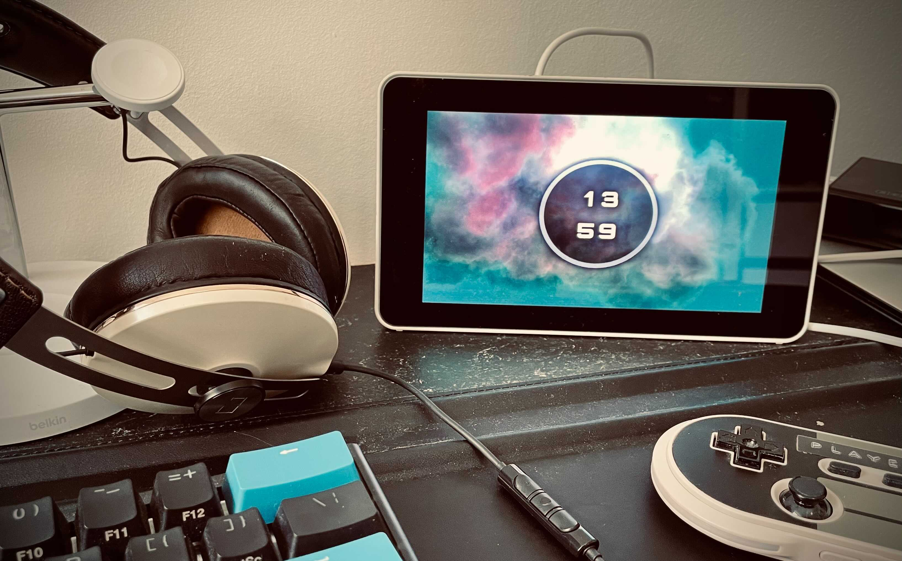

# Docker Dash

A boiler plate for building and deploying kiosk applications using `electron` and `docker` to headless computers with `docker` as the only target system dependency (No "X" required).

This is a great way to easily build and maintain stuf like a Raspberry PI powered dashboard

**IMPORTANT:** This does come with some security remarks worth knowing, so please read [this](docs/security.md)

## Developing your application

Simple modify `src/electron.ts` and `src/frontend.ts` as you would any other `electron` app.

If you don't want to develop your own application, but simply want it to show an already exisiting website, you can change the argument of `loadFile` on `src/electron.ts` to be that of the target website.

To debug you project you first have to start the bundler using `yarn start:bundler` and keep it open. After that run `yarn start` in a different terminal and the app should open.

## Deploying your application

Once everyting is ready simply run `yarn update` and it will build and run your productionized build using docker.
To easily build and run on a remote target you could use `docker context` (See the [Raspberry PI guide](docs/raspberry.md) for a guide)
